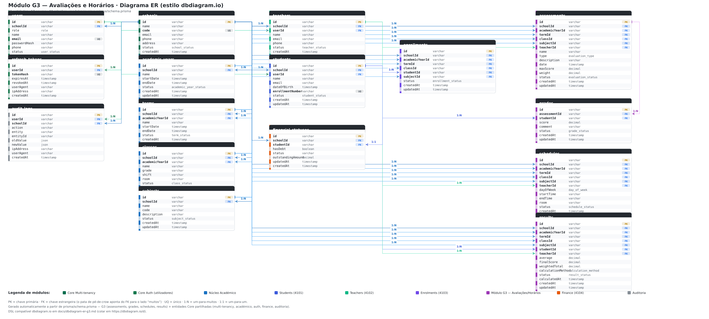

# Diagrama ER — Módulo G3 (Avaliações e Horários)

Documentação do modelo de dados do **Módulo G3 — Avaliações e Horários** no formato
[dbdiagram.io](https://dbdiagram.io/d), incluindo:

1. **DSL dbdiagram.io** pronta a copiar/colar (validada contra `prisma/schema.prisma`);
2. **Diagrama renderizado** com as entidades organizadas por módulo e **cardinalidades explícitas `1:N` / `1:1`** em cada relação;
3. **Dicionário de entidades** (16 tabelas, 17 enums), regras e chaves;
4. **Relação com os outros módulos** (Core: Students 4101, Teachers 4102, Enrolments 4103, Finance 4104).

> As tabelas estão tal como definidas em `prisma/schema.prisma` (names em maze_case das tabelas,
> campos camelCase — mesmos nomes utilizados na DSL para `[ref: ...]`).

---

## 1. DSL dbdiagram.io (colar em https://dbdiagram.io/d)

```dbml
// ============================================================
// Módulo G3 — Avaliações e Horários (Smart Campus UCT-JAC)
// Modelo ER completo com multi-tenancy (schoolId) e integrações
// com os módulos Core (students/teachers/enrolments/finance)
// ============================================================

enum role {
  SUPER_ADMIN
  SCHOOL_ADMIN
  DIRECTOR
  COORDINATOR
  TEACHER
  STUDENT
  PARENT
  SECRETARY
}

enum user_status {
  ACTIVE
  INACTIVE
  BLOCKED
}

enum school_status {
  ACTIVE
  INACTIVE
}

enum academic_year_status {
  ACTIVE
  COMPLETED
  CANCELLED
}

enum term_status {
  ACTIVE
  COMPLETED
  PENDING
  CANCELLED
}

enum class_status {
  ACTIVE
  INACTIVE
}

enum teacher_status {
  ACTIVE
  INACTIVE
}

enum student_status {
  ACTIVE
  INACTIVE
  TRANSFERRED
  DROPPED
}

enum subject_status {
  ACTIVE
  INACTIVE
}

enum enrollment_status {
  ACTIVE
  COMPLETED
  TRANSFERRED
  CANCELLED
}

enum evaluation_type {
  TEST
  EXAM
  ASSIGNMENT
  QUIZ
  PROJECT
  PRACTICAL
  ORAL
  OTHER
}

enum evaluation_status {
  DRAFT
  SCHEDULED
  OPEN
  CLOSED
  CANCELLED
}

enum grade_status {
  SUBMITTED
  APPROVED
  REVISED
}

enum schedule_status {
  ACTIVE
  INACTIVE
  CANCELLED
}

enum day_of_week {
  MONDAY
  TUESDAY
  WEDNESDAY
  THURSDAY
  FRIDAY
  SATURDAY
}

enum result_status {
  APPROVED
  FAILED
  RECOVERY
  PENDING
  IN_PROGRESS
}

enum calculation_method {
  ARITHMETIC_MEAN
  WEIGHTED_PERCENTAGE
  PERCENTAGE_SUM
  NORMALIZED_WEIGHTED_MEAN
  COMPONENT_BASED
  CUSTOM_WEIGHTED
}

// ------------- NÚCLEO CORE (multi-tenancy) -------------

Table schools {
  id        varchar          [pk]
  name      varchar          [not null]
  code      varchar          [unique, not null]
  email     varchar
  phone     varchar
  address   varchar
  status    school_status    [not null, default: 'ACTIVE']
  createdAt timestamp        [not null]
  updatedAt timestamp        [not null]

  Note: 'Escola / instituição (multi-tenancy). Dono: Core Schools.'
}

Table users {
  id           varchar      [pk]
  schoolId     varchar      [not null, ref: > schools.id]
  role         role         [not null]
  name         varchar      [not null]
  email        varchar      [unique, not null]
  passwordHash varchar      [not null]
  phone        varchar
  status       user_status  [not null, default: 'ACTIVE']
  createdAt    timestamp    [not null]
  updatedAt    timestamp    [not null]

  indexes {
    (schoolId) [name: 'idx_users_school']
    (role)     [name: 'idx_users_role']
  }

  Note: 'Autenticação/RBAC. 1:1 opcional com Teacher/Student (userId). Dono: Core Auth.'
}

Table refresh_tokens {
  id        varchar   [pk]
  userId    varchar   [not null, ref: > users.id]
  tokenHash varchar   [unique, not null]
  expiresAt timestamp [not null]
  revokedAt timestamp
  userAgent varchar
  ipAddress varchar
  createdAt timestamp [not null]

  indexes {
    (userId)    [name: 'idx_rt_user']
    (expiresAt) [name: 'idx_rt_exp']
  }

  Note: 'Sessões refresh token. Dono: Core Auth.'
}

// ------------- MÓDULO ACADÊMICO CORE -------------

Table academic_years {
  id        varchar   [pk]
  schoolId  varchar   [not null, ref: > schools.id]
  name      varchar   [not null]
  startDate timestamp [not null]
  endDate   timestamp [not null]
  status    academic_year_status [not null, default: 'ACTIVE']
  createdAt timestamp [not null]
  updatedAt timestamp [not null]

  indexes {
    (schoolId, name) [unique, name: 'uq_ay_school_name']
    (schoolId, status) [name: 'idx_ay_school_status']
  }
}

Table terms {
  id             varchar [pk]
  schoolId       varchar [not null, ref: > schools.id]
  academicYearId varchar [not null, ref: > academic_years.id]
  name           varchar [not null]
  startDate      timestamp [not null]
  endDate        timestamp [not null]
  status         term_status [not null, default: 'ACTIVE']
  createdAt      timestamp [not null]
  updatedAt      timestamp [not null]
}

Table classes {
  id             varchar [pk]
  schoolId       varchar [not null, ref: > schools.id]
  academicYearId varchar [not null, ref: > academic_years.id]
  name           varchar [not null]
  grade          varchar [note: '1º, 2º, 3º ano, ...']
  shift          varchar
  room           varchar
  status         class_status [not null, default: 'ACTIVE']
  createdAt      timestamp [not null]
  updatedAt      timestamp [not null]

  indexes {
    (schoolId, status) [name: 'idx_classes_school_status']
  }
}

Table teachers {
  id        varchar [pk]
  schoolId  varchar [not null, ref: > schools.id]
  userId    varchar [unique, ref: > users.id]
  name      varchar [not null]
  email     varchar
  phone     varchar
  status    teacher_status [not null, default: 'ACTIVE']
  createdAt timestamp [not null]
  updatedAt timestamp [not null]

  Note: 'Professor. userId opcional (1:1 com contas de acesso). Dono: Core Teachers (4102).'
}

Table students {
  id               varchar [pk]
  schoolId         varchar [not null, ref: > schools.id]
  userId           varchar [unique, ref: > users.id]
  name             varchar [not null]
  email            varchar
  dateOfBirth      timestamp
  enrollmentNumber varchar [unique]
  status           student_status [not null, default: 'ACTIVE']
  createdAt        timestamp [not null]
  updatedAt        timestamp [not null]

  indexes {
    (schoolId, status) [name: 'idx_students_school_status']
  }

  Note: 'Aluno. userId opcional (1:1). Dono: Core Students (4101).'
}

Table subjects {
  id          varchar [pk]
  schoolId    varchar [not null, ref: > schools.id]
  name        varchar [not null]
  code        varchar [note: 'SUBJ1, SUBJ2, ...']
  description varchar
  status      subject_status [not null, default: 'ACTIVE']
  createdAt   timestamp [not null]
  updatedAt   timestamp [not null]
}

Table enrollments {
  id             varchar [pk]
  schoolId       varchar [not null, ref: > schools.id]
  academicYearId varchar [not null, ref: > academic_years.id]
  termId         varchar [not null, ref: > terms.id]
  classId        varchar [not null, ref: > classes.id]
  studentId      varchar [not null, ref: > students.id]
  subjectId      varchar [not null, ref: > subjects.id]
  status         enrollment_status [not null, default: 'ACTIVE']
  createdAt      timestamp [not null]
  updatedAt      timestamp [not null]

  indexes {
    (studentId, classId, subjectId, termId) [unique, name: 'uq_enrollment']
    (schoolId, status) [name: 'idx_enrollments_school_status']
  }

  Note: 'Matrícula do aluno numa turma+disciplina+período. Dono: Core Enrolments (4103).'
}

// ------------- MÓDULO G3 — AVALIAÇÕES -------------

Table assessments {
  id             varchar [pk]
  schoolId       varchar [not null, ref: > schools.id]
  academicYearId varchar [not null, ref: > academic_years.id]
  termId         varchar [not null, ref: > terms.id]
  classId        varchar [not null, ref: > classes.id]
  subjectId      varchar [not null, ref: > subjects.id]
  teacherId      varchar [not null, ref: > teachers.id]
  name           varchar [not null]
  type           evaluation_type [not null, default: 'TEST']
  description    varchar
  date           timestamp [not null]
  maxScore       decimal [not null, default: 20] // CHECK (maxScore > 0)
  weight         decimal [not null, default: 1]  // CHECK (weight > 0)
  status         evaluation_status [not null, default: 'DRAFT']
  createdAt      timestamp [not null]
  updatedAt      timestamp [not null]

  indexes {
    (termId, classId, subjectId, name) [unique, name: 'uq_assessment']
    (schoolId, classId)  [name: 'idx_assessments_school_class']
    (schoolId, subjectId)[name: 'idx_assessments_school_subject']
    (teacherId)          [name: 'idx_assessments_teacher']
    (date)               [name: 'idx_assessments_date']
    (status)             [name: 'idx_assessments_status']
  }

  Note: 'Avaliação (Teste/Exame/Projeto/...). Dono: Módulo G3.'
}

Table grades {
  id           varchar [pk]
  assessmentId varchar [not null, ref: > assessments.id]
  studentId    varchar [not null, ref: > students.id]
  score        decimal [not null] // CHECK (0 <= score <= maxScore)
  comment      varchar
  status       grade_status [not null, default: 'SUBMITTED']
  createdAt    timestamp [not null]
  updatedAt    timestamp [not null]

  indexes {
    (assessmentId, studentId) [unique, name: 'uq_grade']
  }

  Note: '1 nota por aluno por avaliação. Dono: Módulo G3.'
}

Table schedules {
  id             varchar [pk]
  schoolId       varchar [not null, ref: > schools.id]
  academicYearId varchar [not null, ref: > academic_years.id]
  termId         varchar [not null, ref: > terms.id]
  classId        varchar [not null, ref: > classes.id]
  subjectId      varchar [not null, ref: > subjects.id]
  teacherId      varchar [not null, ref: > teachers.id]
  dayOfWeek      day_of_week [not null]
  startTime      varchar [not null] // 'HH:mm', CHECK (start < end)
  endTime        varchar [not null]
  room           varchar [note: 'Sala 201, Laboratório de Informática, ...']
  status         schedule_status [not null, default: 'ACTIVE']
  createdAt      timestamp [not null]
  updatedAt      timestamp [not null]

  indexes {
    (schoolId, teacherId, dayOfWeek) [name: 'idx_sched_teacher_day']
    (schoolId, classId, dayOfWeek)   [name: 'idx_sched_class_day']
    (schoolId, room, dayOfWeek)      [name: 'idx_sched_room_day']
  }

  Note: 'Conflito professor/turma/sala no mesmo dia+período -> 409 (regra no service). Dono: Módulo G3.'
}

Table results {
  id                varchar [pk]
  schoolId          varchar [not null, ref: > schools.id]
  academicYearId    varchar [not null, ref: > academic_years.id]
  termId            varchar [not null, ref: > terms.id]
  classId           varchar [not null, ref: > classes.id]
  subjectId         varchar [not null, ref: > subjects.id]
  studentId         varchar [not null, ref: > students.id]
  teacherId         varchar [ref: > teachers.id]
  average           decimal [note: 'média ponderada das notas']
  finalScore        decimal
  weightedTotal     decimal
  calculationMethod calculation_method
  status            result_status [not null, default: 'PENDING']
  calculatedAt      timestamp
  createdAt         timestamp [not null]
  updatedAt         timestamp [not null]

  indexes {
    (studentId, classId, subjectId, termId) [unique, name: 'uq_result']
  }

  Note: 'Resultado derivado das notas (média ponderada). PATCH never edits manually. Dono: Módulo G3.'
}

// ------------- MÓDULO FINANCEIRO CORE -------------

Table financial_statuses {
  id                varchar  [pk]
  schoolId          varchar  [not null, ref: > schools.id]
  studentId         varchar  [not null, unique, ref: > students.id]
  hasDebt           boolean  [not null, default: false]
  status            varchar  [not null, default: 'REGULAR'] // REGULAR | IN_DEBT
  outstandingAmount decimal  [not null, default: 0]
  updatedAt         timestamp [not null]
  createdAt         timestamp [not null]

  indexes {
    (schoolId) [name: 'idx_fin_school']
    (status)   [name: 'idx_fin_status']
  }

  Note: 'Situação financeira do aluno (1:1). 3 alunos com dívida no seed (17 500 MT). Dono: Core Finance (4104).'
}

// ------------- AUDITORIA -------------

Table audit_logs {
  id        varchar [pk]
  userId    varchar [ref: > users.id]
  schoolId  varchar [ref: > schools.id]
  action    varchar [not null]  // CREATE | UPDATE | DELETE
  entity    varchar [not null]  // Assessment, Grade, Schedule, Result, ...
  entityId  varchar
  oldValue  json
  newValue  json
  ipAddress varchar
  userAgent varchar
  createdAt timestamp [not null]

  indexes {
    (schoolId) [name: 'idx_audit_school']
    (userId)   [name: 'idx_audit_user']
    (entity)   [name: 'idx_audit_entity']
    (entityId) [name: 'idx_audit_entityid']
  }

  Note: 'Auditoria de operações (ver/criar evidência de testes e2e).'
}
```

> **Como usar:** criar novo diagrama em https://dbdiagram.io/d, colar o bloco acima e clicar em
> "Import". O resultado visual reproduz o modelo com as tabelas, chaves (PK/FK), enums e índices.

---

## 1.1 Diagrama renderizado (estilo dbdiagram.io)

Imagem gerada a partir do mesmo modelo (SVG/PNG). A figura mostra as **16 entidades organizadas
em faixas por módulo** e, junto a cada relacionamento, a **cardinalidade `1:N` / `1:1`**:



- **SVG vectorial:** [`docs/diagrams/er-diagram-g3-dbdiagram.svg`](../diagrams/er-diagram-g3-dbdiagram.svg)
- **PNG (alta resolução, para relatórios/Word):** [`docs/diagrams/er-diagram-g3-dbdiagram.png`](../diagrams/er-diagram-g3-dbdiagram.png)

---

## 1.2 Organização das entidades por módulo

O modelo é **multi-tenancy**: todas as entidades têm `schoolId` que aponta para `schools`. As
faixas coloridas do diagrama correspondem ao núcleo funcional de cada tabela:

| Núcleo / módulo | Entidades | Porta a que se liga |
|---|---|---|
| Multi-tenancy | `schools` | — |
| Core Auth (RBAC) | `users`, `refresh_tokens` | — |
| Core Académico | `academic_years`, `terms`, `classes`, `subjects` | — |
| Core Teachers | `teachers` | 4102 |
| Core Students | `students` | 4101 |
| Core Enrolments | `enrollments` | 4103 |
| **Módulo G3** | `assessments`, `grades`, `schedules`, `results` | 4100 |
| Core Finance | `financial_statuses` | 4104 |
| Auditoria | `audit_logs` | — |

**Como ler o diagrama:**
- A **pata de pé-de-crow** (Δ) indica o lado "muitos" (`N`); o **traço** indica o lado "um" (`1`).
- A etiqueta **`1:N`** junto à chave estrangeira lê-se "uma entidade de origem tem muitas da destino".
- A etiqueta **`1:1`** marca as relações únicas (`teachers.userId`, `students.userId`,
  `financial_statuses.studentId`) — contas de acesso e situação financeira são exclusivas.
- Relações **N:N** (aluno–disciplina, aluno–avaliação) não existem directamente: são
  materializadas pelas entidades-associação `enrollments` e `grades`.

---

## 2. Diagrama ER (vista lógica — cardinalidades `1:N` / `1:1`)

Vista lógica simplificada que mostra a estrutura do modelo com as cardinalidades:

```
                          CORE (multi-tenancy)                G3 — AVALIAÇÕES E HORÁRIOS
 ┌─────────────────┐     ┌───────────────────────────┐        ┌───────────────────────────┐
 │    SCHOOLS      │1──< │   ACADEMIC_YEARS          │        │      ASSESSMENTS          │
 │ id PK           │     │ id PK                      │        │ id PK                     │
 │ name            │     │ schoolId FK >──────────────┘        │ schoolId FK >-schools     │
 │ code UQ         │     │ name UQ(schoolId+name)      │        │ academicYearId FK >-ay    │
 │ status          │     └───────────────────────────┘        │ termId FK >-terms         │
 └─────────────────┘        │                                  │ classId FK >-classes      │
          ▲                  │                                  │ subjectId FK >-subjects   │
          │                  ▼                                  │ teacherId FK >-teachers   │
 ┌───────────────────────────────┐                              │ name / type / date / ... │
 │           USERS               │                              │ UQ(term,class,subject,    │
 │ id PK                         │                              │     name)                 │
 │ schoolId FK >-schools         │                              └───────────────────────────┘
 │ email UQ / role / status      │                                          │ 1:*
 └───────────────────────────────┘                                          ▼
          │ 1:1 (opcional)                                        ┌───────────────────────────┐
          ▼                                                       │          GRADES           │
 ┌───────────────────────────────┐    ┌───────────────────────┐   │ id PK                     │
 │        TEACHERS               │    │       STUDENTS        │   │ assessmentId FK >-assess   │
 │ id PK                         │    │ id PK                 │   │ studentId FK >-students    │
 │ schoolId FK >-schools         │    │ schoolId FK >-schools │   │ UQ(assessment,student)    │
 │ userId FK UQ >-users          │    │ userId FK UQ >-users  │   │ score [0..maxScore]      │
 │ name / email / status         │    │ enrollmentNumber UQ   │   └───────────────────────────┘
 └───────────────────────────────┘    └───────────────────────┘
  1:*
 ┌───────────────────────────────┐ 1:1  ┌───────────────────────┐     ┌───────────────────────────┐
 │      ENROLLMENTS              │      │  FINANCIAL_STATUSES   │     │         SCHEDULES        │
 │ id PK                         │      │ id PK / studentId UQ  │     │ id PK                    │
 │ schoolId/term/class/student/  │      │ hasDebt / status      │     │ term/class/subject/      │
 │ subject FKs                   │      │ outstandingAmount     │     │ teacher FKs / dayOfWeek  │
 │ UQ(student,class,subject,term)│      └───────────────────────┘     │ startTime/endTime/room  │
 └───────────────────────────────┘            (Finance 4104)         └───────────────────────────┘
  1:*
 ┌───────────────────────────────┐      ┌───────────────────────────┐
 │          TERMS                │      │          RESULTS          │
 │ id PK / academicYearId FK     │      │ id PK                     │
 │ name / startDate / endDate    │      │ student/class/subject/    │
 └───────────────────────────────┘      │ term FKs                  │
                                         │ UQ(student,class,subject, │
 ┌───────────────────────────────┐      │     term)                 │
 │          SUBJECTS             │      │ average / status          │
 │ id PK / name / code           │      └───────────────────────────┘
 └───────────────────────────────┘
 ```

**Legenda:** `PK` chave primária · `FK` chave estrangeira · `UQ` unique · `1:*` um-para-muitos ·
`1:1` um-para-um. A cardinalidade "muitos" está sempre do lado das tabelas do módulo G3
(avaliações → notas, resultados por aluno/disciplina/período).

> Relações **N:N** lógicas (estudante↔disciplina, estudante↔avaliação) são representadas por
> entidades-associação: `enrollments` (aluno × turma × disciplina × período) e `grades`
> (aluno × avaliação, 1 nota — `UQ(assessmentId, studentId)`).

---

## 3. Dicionário de entidades

| Tabela | Descrição | Dono | Relações-chave |
|---|---|---|---|
| `schools` | Escola/instituição (multi-tenancy) | Core | raiz de todas as outras |
| `users` | Conta de autenticação (RBAC: `SUPER_ADMIN`…`STUDENT`) | Core Auth | → `schools`, 1:1 com `teachers`/`students` |
| `refresh_tokens` | Sessões/refresh tokens | Core Auth | → `users` |
| `academic_years` | Ano lectivo (ex.: 2026) | Core | → `schools`, `terms` |
| `terms` | Período/trimestre (ex.: 1º Trimestre) | Core | → `academic_years`, `schools` |
| `classes` | Turma (ex.: Eng. Informática – 1º Ano) | Core | → `schools`, `academic_years` |
| `teachers` | Professor | Core Teachers (4102) | → `schools`, `users` (1:1) |
| `students` | Aluno (nº de matrícula `UCJAC-2026-NNN`) | Core Students (4101) | → `schools`, `users` (1:1) |
| `subjects` | Disciplina | Core | → `schools` |
| `enrollments` | Matrícula (aluno × turma × disciplina × período) | Core Enrolments (4103) | → `students`, `classes`, `subjects`, `terms` |
| `assessments` | Avaliação (teste/exame/projeto) — **G3** | Módulo G3 | → `schools`, `teachers`, `classes`, `subjects`, `terms` |
| `grades` | Nota de um aluno numa avaliação — **G3** | Módulo G3 | → `assessments`, `students` |
| `schedules` | Horário de aula (dia, `HH:mm`, sala) — **G3** | Módulo G3 | → `classes`, `subjects`, `teachers`, `terms` |
| `results` | Resultado final (média ponderada) — **G3** | Módulo G3 | → `students`, `classes`, `subjects`, `terms` |
| `financial_statuses` | Situação financeira do aluno (1:1) | Core Finance (4104) | → `students` (única), `schools` |
| `audit_logs` | Auditoria de operações | Core | → `users`, `schools` |

### Enums e estados

| Enum | Valores | Onde |
|---|---|---|
| `Role` | `SUPER_ADMIN`, `SCHOOL_ADMIN`, `DIRECTOR`, `COORDINATOR`, `TEACHER`, `STUDENT`, `PARENT`, `SECRETARY` | `users` |
| `UserStatus` | `ACTIVE`, `INACTIVE`, `BLOCKED` | `users` |
| `EvaluationType` | `TEST`, `EXAM`, `ASSIGNMENT`, `QUIZ`, `PROJECT`, `PRACTICAL`, `ORAL`, `OTHER` | `assessments` |
| `EvaluationStatus` | `DRAFT`, `SCHEDULED`, `OPEN`, `CLOSED`, `CANCELLED` | `assessments` |
| `GradeStatus` | `SUBMITTED`, `APPROVED`, `REVISED` | `grades` |
| `ScheduleStatus` | `ACTIVE`, `INACTIVE`, `CANCELLED` | `schedules` |
| `DayOfWeek` | `MONDAY`…`SATURDAY` | `schedules` |
| `ResultStatus` | `APPROVED`, `FAILED`, `RECOVERY`, `PENDING`, `IN_PROGRESS` | `results` |
| `CalculationMethod` | `ARITHMETIC_MEAN`, `WEIGHTED_PERCENTAGE`, `PERCENTAGE_SUM`, `NORMALIZED_WEIGHTED_MEAN`, `COMPONENT_BASED`, `CUSTOM_WEIGHTED` | `results` |

---

## 4. Relações e regras do módulo G3

**Mapa completo de relacionamentos (`1:N` / `1:1`).** O lado "muitos" (`N`) é sempre a entidade
que contém a chave estrangeira:

| Entidade (lado 1) | Relação | Entidade (lado N) | Cardinalidade | O que liga |
|---|---|---|---|---|
| `schools` | — | todas as entidades (`schoolId`) | 1:N | multi-tenancy |
| `users` | — | `teachers` / `students` (`userId`) | **1:1** | conta de acesso exclusiva |
| `users` | — | `refresh_tokens` | 1:N | sessões da conta |
| `academic_years` | — | `terms` | 1:N | períodos do ano lectivo |
| `classes` | — | `enrollments` · `assessments` · `schedules` · `results` | 1:N | turmas avaliadas/horários/resultados |
| `subjects` | — | `enrollments` · `assessments` · `schedules` · `results` | 1:N | disciplinas avaliadas |
| `teachers` | — | `assessments` · `schedules` · `results` | 1:N | docente responsável |
| `students` | — | `enrollments` · `grades` · `results` | 1:N | aluno avaliado/matriculado |
| `students` | — | `financial_statuses` | **1:1** | situação financeira (Finance 4104) |
| `assessments` | — | `grades` | 1:N | notas da avaliação |
| `terms` | — | `assessments` · `schedules` · `enrollments` · `results` | 1:N | período do lançamento |

**Relações N:N (materializadas por entidades-associação):**
- `students` ↔ `subjects` (e `classes`, `terms`) → resolvida por **`enrollments`**
  (`UQ(studentId, classId, subjectId, termId)` — 1 matrícula única);
- `students` ↔ `assessments` → resolvida por **`grades`**
  (`UQ(assessmentId, studentId)` — 1 nota por aluno por avaliação).

**Regras que o diagrama materializa:**
- **1 nota por aluno/avaliação** → `UQ(assessmentId, studentId)` em `grades` (duplicada → 409).
- **Sem avaliações duplicadas** → `UQ(termId, classId, subjectId, name)` em `assessments`.
- **1 resultado por contexto** → `UQ(studentId, classId, subjectId, termId)` em `results`.
- **1 matrícula única** → `UQ(studentId, classId, subjectId, termId)` em `enrollments`.
- **Nota dentro do intervalo** → `CHECK (0 <= score <= maxScore)`; `maxScore`/`weight` imutáveis após notas.
- **Horários sem conflitos** → índices compostos `(teacherId, dayOfWeek)`, `(classId, dayOfWeek)`, `(room, dayOfWeek)` usados na regra de conflito (409).
- **Resultados derivados** — `average`/`finalScore` calculados a partir das notas (nunca editados manualmente; recalcule em lote).

---

## 5. Integração com os outros módulos (contratos HTTP)

O G3 não lê directamente as tabelas dos outros módulos: usa **contratos HTTP** através do
`contracts/gateway.ts`, sempre com `x-correlation-id` e limit `CONTRACT_TIMEOUT_MS`.

| Serviço Core | Porta | Contrato utilizado pelo G3 | Uso |
|---|---|---|---|
| Students | 4101 | `GET /students/:id` · `GET /students?classId=` | validar aluno, nomear DTOs, catálogo |
| Teachers | 4102 | `GET /teachers/:id` | professor na avaliação/horário |
| Enrolments | 4103 | `GET /enrolments?termId=&classId=&subjectId=` | matrícula obrigatória para lançar nota |
| Finance | 4104 | `GET /financial-status/:studentId` (service token) | regra financeira (bloqueio de notas) |
| Finance | 4104 | `POST /financial/integration/assessment-charges` (idempotente) | cobrança de avaliação |

**Regra financeira (fail-closed):** consulta de notas por `STUDENT` → verifica `financial_statuses`
do aluno via Finance; com dívida → `403 FINANCIAL_ACCESS_BLOCKED`; serviço indisponível →
`503 FINANCIAL_VERIFICATION_UNAVAILABLE`. A pauta (staff) mascara os endividados
(`debtRestricted: true`, `average: null`).

---

## 6. Dados de teste reais

O dataset determinístico (1 escola UJAC, 10 alunos, 5 avaliações, 40 notas, 90 resultados,
27 horários, 10 situações financeiras — 3 com dívida) está documentado em
[`dados-reais-teste.md`](./dados-reais-teste.md) e é reproduzível com
`npm run db:reset -- --force` (notas por `(gSeq*7+3) mod (maxScore+1)`).