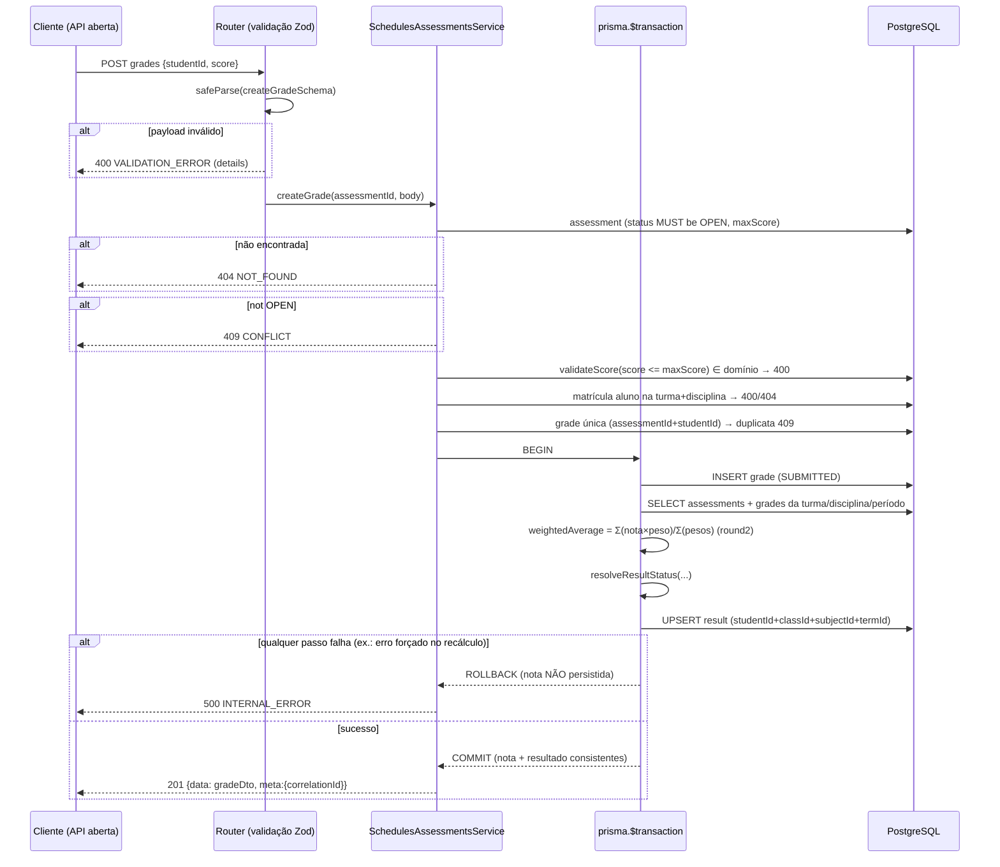

# Sequência — Lançar Nota com Recálculo Atómico (ACID)

Fluxo de `POST /api/v1/assessments/:assessmentId/grades`.

Coberto por `tests/g3.transaction.e2e.test.js` (rollback forçado via stub de `_recalculateInTx`: a nota transacionada não fica persistida e o resultado anterior mantém-se).