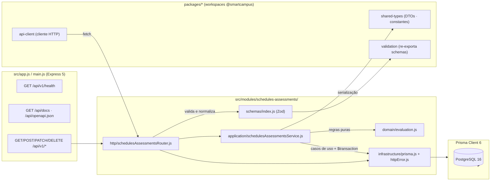

# Diagrama de Componentes — Módulo G3 (Estrutura aplicada)

**Frontier/regra**: os schemas Zod autoritativos vivem no módulo (`schemas/index.js`); `packages/validation` apenas os re-exporta para outros módulos/futura infra. DTOs partilhados ficam em `packages/shared-types`. `httpError.js` centraliza o mapeamento erro → HTTP (inclui P2002 → 409).