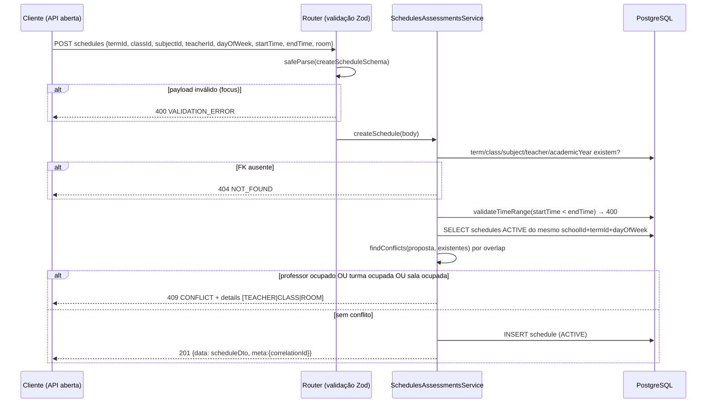

# Sequência — Criação de Horário com Deteção de Conflitos

Fluxo de `POST /api/v1/schedules`.

Coberto por `tests/g3.e2e.test.js` (SATURDAY/10:00–11:40 criado com sucesso; reenvio idêntico → 409 com `details`; DELETE → 200).