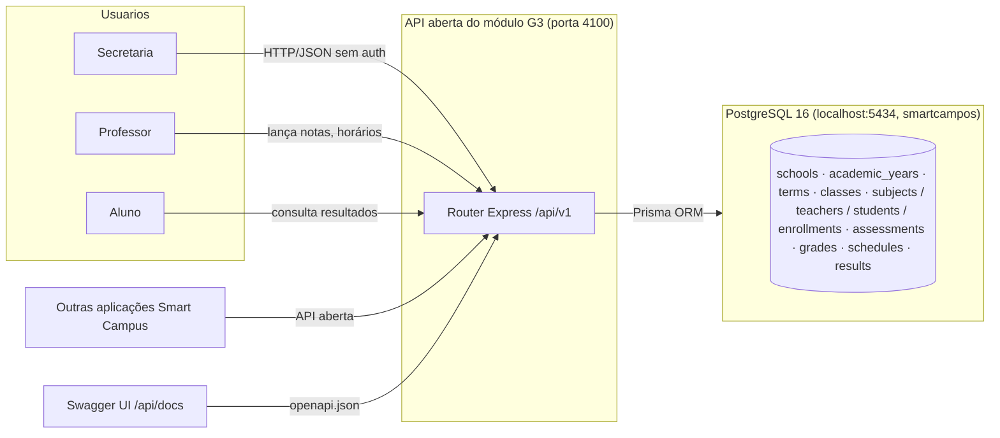

# Diagrama de Contexto do Sistema — Módulo G3

**Notas de contexto**
- API **aberta**: nenhum mecanismo de autenticação (sem JWT/Bearer/RBAC/Senha) neste módulo — sem `401/403`.
- Contrato uniforme: sucesso `{data, meta:{correlationId}}`, erro `{code, message, details, correlationId}`.
- `swagger-ui-dist` servido localmente em `/api/docs` (sem CDN externo).